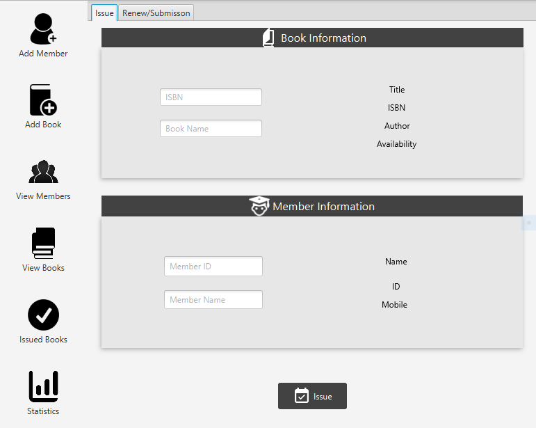
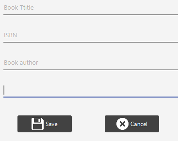
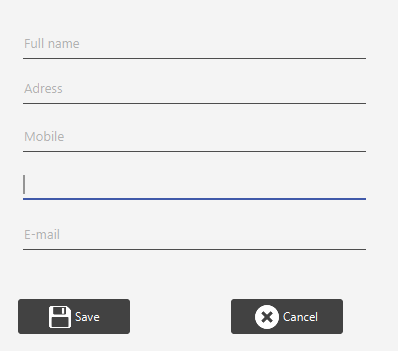
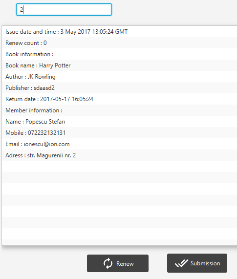
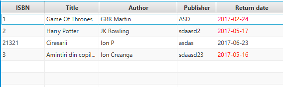
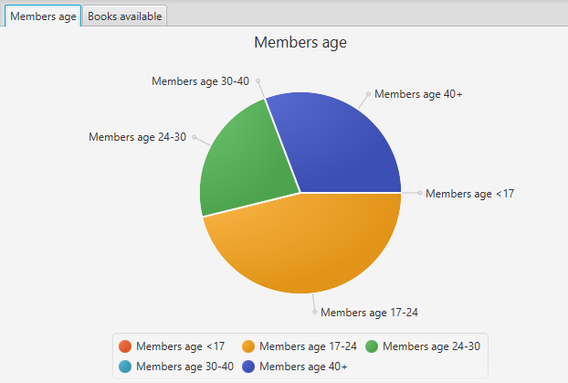
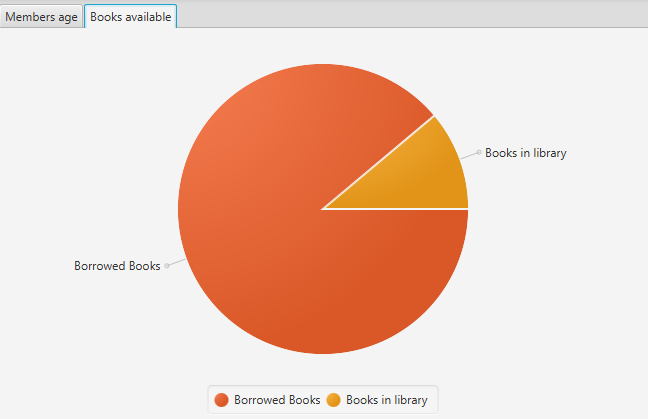
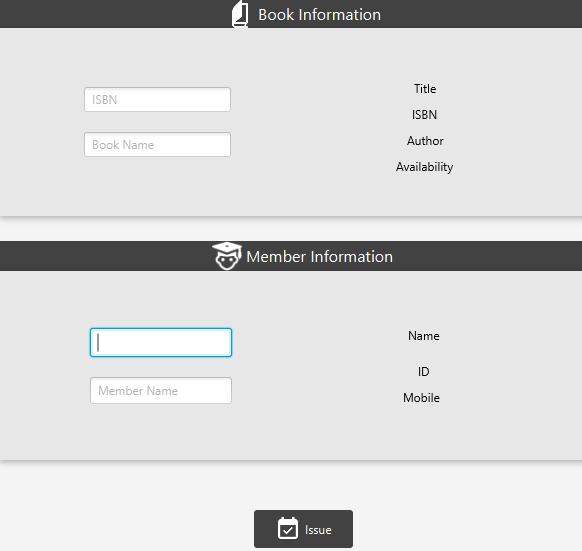

# Library Management System developed in Java and JavaFX
LMS is a resource planning system for a library, used to track items owned and patrons who have borrowed.

 ## 
 ## 
 ## 
 ## 
 ## 
 ## 
 ## 
 ## 
 ## 
 
